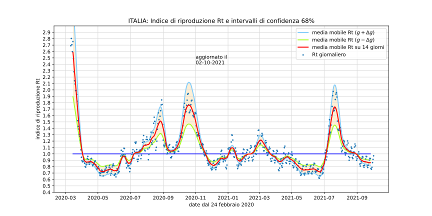

# Calcolo dell'indice di riproduzione <em>Rt</em> del Covid-19

Riportiamo qui i materiali didattici accessori collegati alla pagina presente in [www.lorenzoroi.net](https://www.lorenzoroi.net) e relativa al [calcolo dell'indice <em>Rt</em>](https://www.lorenzoroi.net/indiceRt/indiceRt.html) del Covid-19.

I supporti didattici sono costituiti da

- un foglio di calcolo Excel, `nuoviPositivi-IT.xlsx` dove seguendo il [diagramma](https://www.lorenzoroi.net/indiceRt/indiceRt.html#fig08) di flusso presente nella pagina di riferimento, si riportano formule, calcoli e rappresentazioni grafiche associati a tutti i parametri coinvolti.

- Seguono quindi cinque notebook di [Jupyter](https://jupyter.org) ciascuno dei quali ha per obiettivi,  
    - `prelevaRinomina.ipynb` preleva dal repository Dipartimento della Protezione Civile  [DPC Covid-19](https://github.com/pcm-dpc/COVID-19) i file di dati necessari ai successivi quattro notebook e li rinomina coerentemente alla data di prelievo;
    - `medieMobiliNuoviPositivi.ipynb` sulla base dei due file prelevati con il precedente notebook,  rappresenta i dati giornalieri dei nuovi positivi ed esegue, di questi, due medie mobili di 7 e 14 giorni;
    - `tassoCrescitaLambda.ipynb` calcola il tasso di crescita &lambda; tramite una regressione lineare, esegue una sua media mobile e ne rappresenta l'andamento;
    - `indiceRiproduzioneRt.ipynb` calcola l'indice di riproduzione sulla base di una stima del tempo di generazione e del parametro &lambda;, esegue una sua media mobile e rappresenta i risultati assieme, eventualmente, agli intervalli di confidenza;
    - `indiceRt-30giorni.ipynb` calcola l'indice di riproduzione e gli intervalli di confidenza degli ultimi 30 giorni e li riporta in forma numerica a video. 

## Consultazione

Nel caso si intenda visualizzare solo il contenuto dei cinque notebook avviare *Nbviewer* con il pulsante sottostante.

## Sperimentazione

Se invece si vuole sperimentare online in modo interattivo con i notebook lanciare *Binder*.

<title>attenzione</title><linearGradient id="s" x2="0" y2="100%"><stop offset="0" stop-color="#bbb" stop-opacity=".1"/><stop offset="1" stop-opacity=".1"/></linearGradient><clipPath id="r"><rect width="67" height="20" rx="3" fill="#fff"/></clipPath><g clip-path="url(#r)"><rect width="0" height="20" fill="#e05d44"/><rect x="0" width="67" height="20" fill="#e05d44"/><rect width="67" height="20" fill="url(#s)"/></g><g fill="#fff" text-anchor="middle" font-family="Verdana,Geneva,DejaVu Sans,sans-serif" text-rendering="geometricPrecision" font-size="110"><text aria-hidden="true" x="335" y="150" fill="#010101" fill-opacity=".3" transform="scale(.1)" textLength="570">attenzione</text><text x="335" y="140" transform="scale(.1)" fill="#fff" textLength="570">attenzione</text></g></svg>" title="attenzione" style="width:65%">
 
In alternativa al prelievo dei dati più recenti dal repository del [DPC](https://github.com/pcm-dpc/COVID-19) tramite il notebook `prelevaRinomina.ipynb`, si può comunque iniziare la sperimentazione con i due file di dati già presenti nella cartella e relativi alla data ISO `20210815`. 

In ogni caso il caricamento sul server di *Binder* del solo primo notebook scelto richiede, per poter iniziare l'elaborazione, alcuni secondi di attesa.

*Lorenzo Roi*

